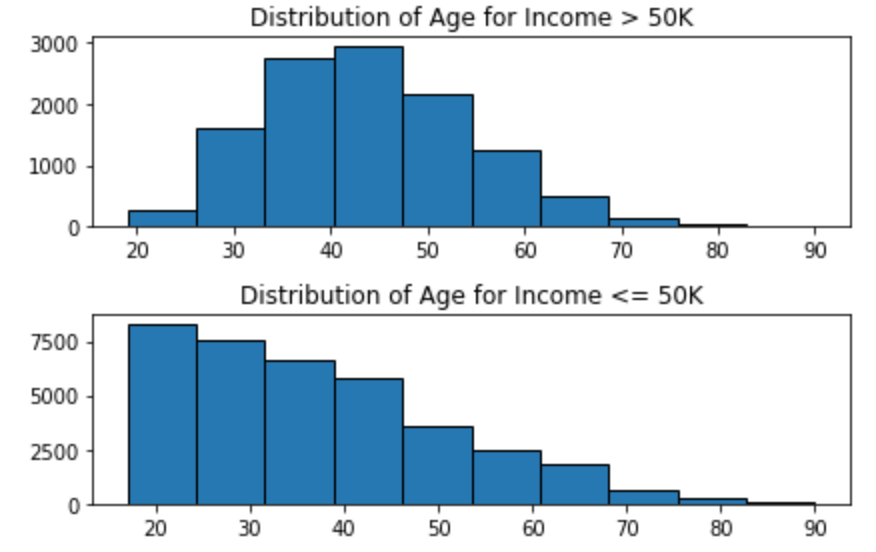

## Model evaluation challenge - US Income
  + Repository name: us-income
  + Duration: 1 day
  + Deadline: 16/Aug/2021 04:30 PM
  + Datasets:  data_train.csv and data_test.csv 
    - ../../../additional_resources/datasets/US Income/cleaned/data_train.csv
    - ../../../additional_resources/datasets/US Income/cleaned/data_test.csv 
#### Must-have features
  + Baseline accuracy
  + Multiple evaluation metrics
  + Hyper parameter tuning
  + Some type of validation strategy

#### Constraints
  + You must use RandomForestClassifier() from sklearn. We want you to focus on model evaluation, not on the model choice nor on the data preprocessing.
  + Create functions, do not create a single huge script
  + Each function or class has to be typed
  + Each function or class has to contain a docstring in a consistent format.
  + Your code should be formatted with black.
  + Your code should be commented.
  + Your code should be cleaned of any commented unused code.

#### File structure
  | Name       | Description                                                                             |
|----------------|---------------------------------------------------------------------------------------|
| 1. model_evaluation.ipynb | The working file                                      |
| 2. dataset | Folder contain the datasets of data_train.csv, data_test.csv                                     |

#### Data exploration
- Data have been cleaned 
- Some visualizations about distribution of features and target
  + Features: Age vs income
  
  

  + Targets: 'income' distribution

#### Machine Learning
- The model has been created with some default parameters RandomForestClassifier(random_state=42, n_estimators=100). 
- I've used OneHotEncoding for treating categorical data. The accuracy is high.
   

   
  
   - The important features from test set
    
    
   - The important features from train set
   
    

 #### Improving models
 
 best_estimator =  RandomForestClassifier(max_features='sqrt', n_estimators=200, random_state=42)

  
  
 #### Conclution: 
 
 The scores of model haven't improve much when I opted the best estimator of 200 and max features ='sqrt'.
